# stellr

**A star-map of your GitHub issues, and an agent multiplexer to work them.**

stellr charts a repository's issues as an interactive star-map — "blocked by"
relationships as edges, milestones as clusters, closed issues as resolved
stars — and lets you take an unblocked issue off the frontier, pick an agent
CLI, and open a terminal session with the issue and its blockers' resolutions
already composed into the opening prompt.

Rust + Tauri 2 desktop app for Windows 11, macOS, and Linux; the same binary
runs headless (`stellr serve`) so the UI can live in VS Code's Simple Browser,
t3code's preview pane, or any browser.

**Status: design phase.** The approved design spec is at
[`docs/specs/2026-07-29-stellr-port-design.md`](docs/specs/2026-07-29-stellr-port-design.md).
No code yet; `reference/` holds assets from the reference implementation that
port verbatim.

## Release constellation compatibility probe

<picture>
  <source media="(prefers-reduced-motion: reduce)" srcset="docs/assets/readme-showcase/compatibility-probe.png">
  
</picture>

[View the static release constellation](docs/assets/readme-showcase/compatibility-probe.png).

This review-branch compatibility fixture shows three fixed stars moving from
blocked work to a resolved path. It exists to verify GitHub's animated,
reduced-motion, and strict-Markdown README delivery paths before the release
exporter replaces it with a real release story.

## Lineage & acknowledgements

stellr is a Rust/Tauri port and generalization of
[chartr](https://github.com/rengwu/chartr) (Go, MIT, © 2026 John Goh) — the
agent multiplexer with a map of the work. Portions of stellr are direct ports
of chartr code; chartr's license notice is retained in
[`LICENSE-chartr`](LICENSE-chartr).

Further upstream:

- [wayfinder-maps](https://github.com/rengwu/wayfinder-maps) — where the
  star-map started
- [herdr](https://github.com/ogulcancelik/herdr) — the terminal agent
  multiplexer that inspired chartr
- [mattpocock/skills](https://github.com/mattpocock/skills) — the original
  `/wayfinder` skill and planning method

## License

MIT — see [LICENSE](LICENSE), which incorporates the retained chartr notice
([LICENSE-chartr](LICENSE-chartr)).
