# stellr

**A star-map of your GitHub issues, and an agent multiplexer to work them.**

Stellr charts repository issues as an interactive star-map: blocking
relationships become edges, milestones become clusters, and completed work
becomes resolved stars. The native shell and the browser-hosted serve mode use
the same Rust application runtime.

**Status: M2 browser server and optional native shell available.** The headless
server is the primary Linux development target; native desktop packages remain
available through explicit platform builds. The approved product design remains
in [`docs/specs/2026-07-29-stellr-port-design.md`](docs/specs/2026-07-29-stellr-port-design.md).

## Build from source

Linux is the primary local development environment. The default build is a
headless Rust server that embeds the web UI and does not link Tauri, GTK, or
WebKitGTK. Install stable Rust, Node.js 24 with npm 12.0.2, and GitHub CLI. The
repository includes `.nvmrc`; with nvm, install the pinned Node major before
running npm commands:

```bash
nvm install
nvm use
npm install --global npm@12.0.2
```

The web workspace also declares strict Node/npm engines, so `npm ci` fails
early if the required versions are not active. From the repository root:

```bash
npm --prefix web ci
npm --prefix web run build
cargo build -p stellr-app --bin stellr
```

The same commands work in other POSIX shells; use `npm`, `cargo`, and `bash`
directly rather than Windows-specific `.cmd` or `.exe` command names.

Run the local validation suite with:

```bash
npm --prefix web run check
npm --prefix web test
npm --prefix web run build
npm --prefix web audit
cargo fmt --all -- --check
cargo clippy --workspace --all-targets --locked -- -D warnings
cargo test --workspace --locked
cargo build --workspace --locked
```

If the web audit reports fixable vulnerabilities, apply lockfile updates from
the repository root with `npm --prefix web audit fix`; the root project has no
Node lockfile, so running plain `npm audit fix` there will fail.

## Linux server and web UI

Authenticate with `gh auth login` or set `GITHUB_TOKEN`, then start the server:

```bash
cargo run -p stellr-app -- serve
cargo run -p stellr-app -- serve --addr 127.0.0.1:0 --issue 70
```

Open the printed `stellr cockpit` URL in a browser. The executable serves the
embedded Svelte application, REST API, and control WebSocket from one process.
Protected routes require the generated session token by default. `--no-token`
is an explicit local-development option; do not expose that listener to
another host.

To bind the optimized server only to this machine's current Tailscale IPv4
address, run:

```bash
npm --prefix web run serve:tailnet
```

This launcher keeps session-token authentication enabled. Override its default
port with `STELLR_PORT=9000 npm --prefix web run serve:tailnet`. Starting it
again gracefully replaces this repository's existing Stellr server on the same
Tailnet address and port, while reusing its existing protected session so open
browser tabs can reconnect after a rebuild. The latest complete authenticated URL is also saved
with owner-only permissions in `target/stellr-tailnet-url.txt`, so it can be
retrieved from another computer over SSH and pasted directly into a browser.
Cross-platform retrieval helpers default to the Tailnet host `amd-halo`:

```bash
bash scripts/get-stellr-tailnet-url.sh
```

Windows Command Prompt and PowerShell users can run
`scripts\get-stellr-tailnet-url.cmd` or
`powershell -File scripts\get-stellr-tailnet-url.ps1`. Set
`STELLR_SSH_USER` to override the default SSH user `pfdev`, or pass another
hostname as the first argument. The client must be authorized to SSH to that
account on `amd-halo` (using an SSH key, password, or Tailscale SSH policy).

The default headless build resolves GitHub credentials in this order:

1. a nonblank `GITHUB_TOKEN` environment variable;
2. the token returned by `gh auth token`.

The provider credential is separate from the random per-run browser session
token printed by serve mode.

## Optional desktop mode

Native desktop development is an explicit feature and is not required for the
Linux server. On Debian or Ubuntu, install its Tauri dependencies and run it
with:

```bash
bash scripts/install-linux-dependencies.sh
cargo run -p stellr-app --features desktop --bin stellr-desktop
cargo run -p stellr-app --features desktop --bin stellr-desktop -- \
  open teloverge/stellr
```

Desktop mode additionally enables OS credential persistence, device
authorization, deep links, single-instance routing, and the native tray. Run a
Secret Service provider such as GNOME Keyring when testing credential storage
on Linux.

## Deep links and single-instance routing

Desktop targets normalize through one route model. Supported forms include:

- local repository paths;
- `owner/repo` GitHub slugs;
- canonical GitHub repository and issue URLs;
- `stellr://space?repo=owner%2Frepo&issue=70` links registered by packages.

Explicit targets override restored state. A bare launch restores the last valid
space and issue while rejecting corrupt or off-origin route data.

## Supported packages

| Platform | Supported package |
| --- | --- |
| Windows 11 x64 | NSIS installer with WebView2 bootstrap support |
| macOS | Universal DMG containing both Apple Silicon and Intel slices |
| Linux x86_64 | AppImage and Debian package |

Pull-request and manual packaging workflows label their outputs
`UNSIGNED-NOT-FOR-RELEASE`. Tagged release candidates fail before publication
unless Windows and macOS signing credentials are configured, pass each native
install/inspection/launch gate, and complete the full repository validation
suite.

<!-- stellr-release-constellation:start -->
## Release constellation

<picture>
  <source media="(prefers-reduced-motion: reduce)" srcset="docs/assets/readme-showcase/m1.png">
  
</picture>

[View the static m1 release constellation](docs/assets/readme-showcase/m1.png).

Release m1 charts 17 visible issues, with 17 resolved at the recorded cutoff.
<!-- stellr-release-constellation:end -->

## Lineage and acknowledgements

Stellr is a Rust/Tauri port and generalization of
[chartr](https://github.com/rengwu/chartr) (Go, MIT, copyright 2026 John Goh).
Ported code retains the chartr notice in [`LICENSE-chartr`](LICENSE-chartr).

Further upstream:

- [wayfinder-maps](https://github.com/rengwu/wayfinder-maps), where the star-map
  started;
- [herdr](https://github.com/ogulcancelik/herdr), the terminal agent
  multiplexer that inspired chartr;
- [mattpocock/skills](https://github.com/mattpocock/skills), the original
  `/wayfinder` planning workflow.

## License

MIT; see [`LICENSE`](LICENSE) and the retained [`LICENSE-chartr`](LICENSE-chartr).
